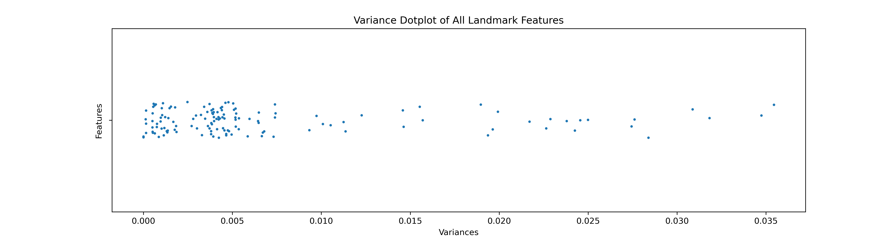
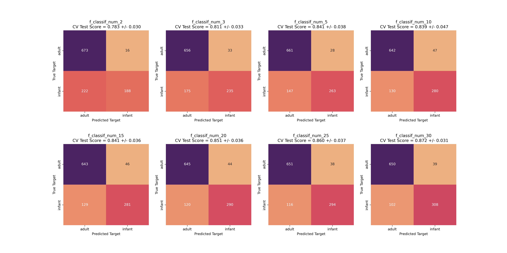
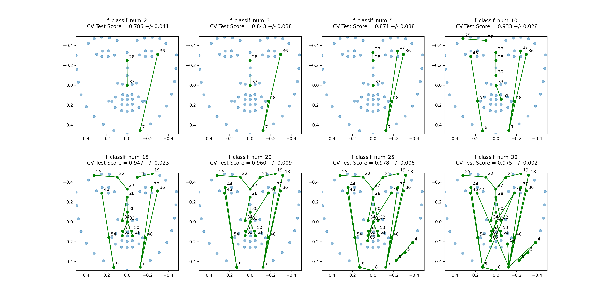
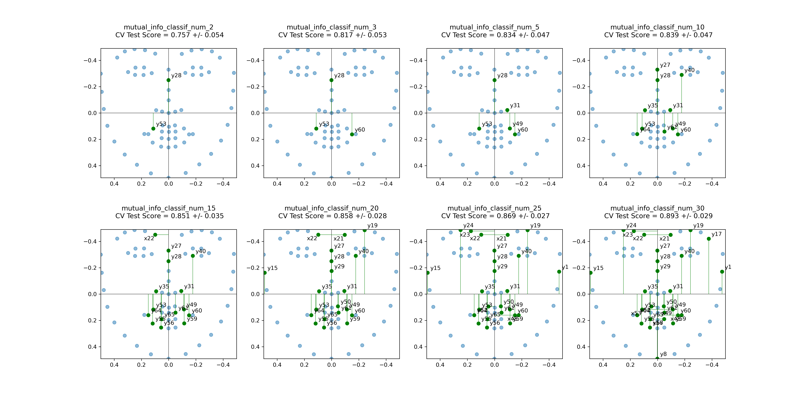
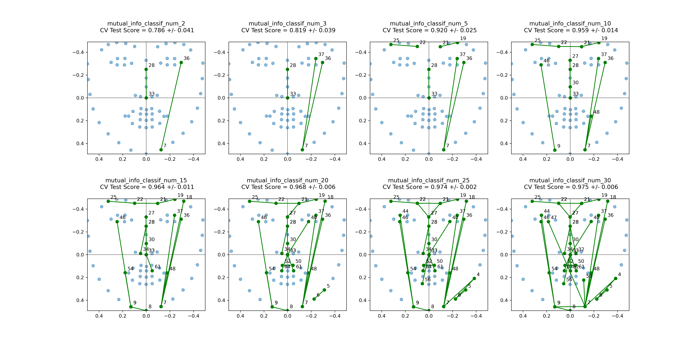
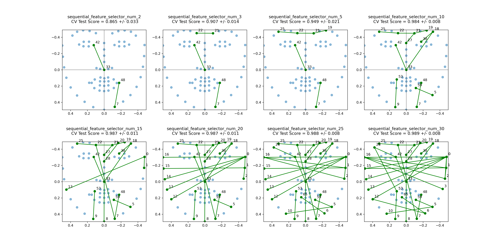
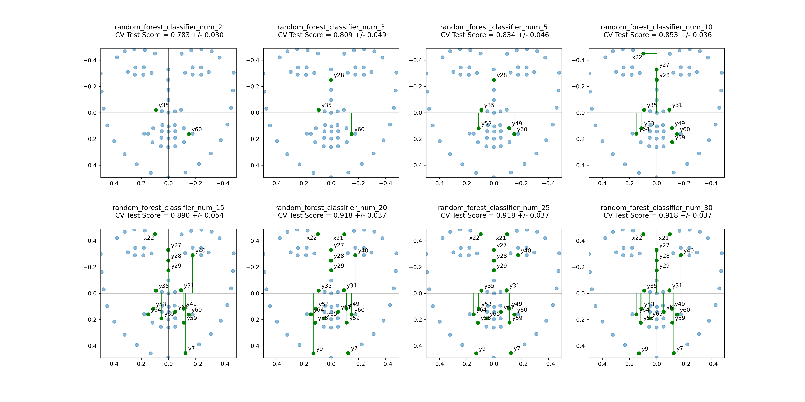
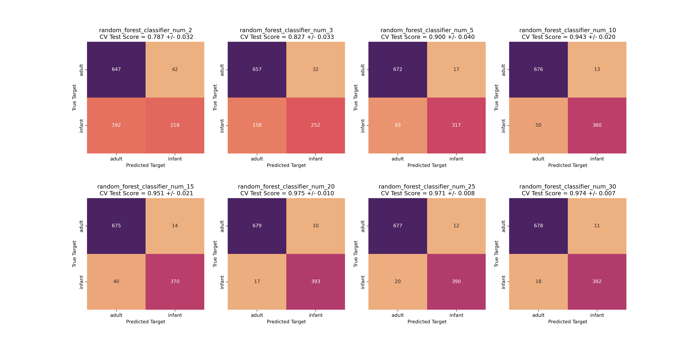

# Feature Selection

During the previous project, three different models were applied to make the adult-infant classification. The adopted features vary between each model: in `SVC`, they applied `PCA` to all landmark coordinates, and also manually selected `boxratio` and `interoc_norm` to build the model. In `Logistic Regression`, they applied `Forward Feature Selection` to all Euclidean Distances, and also manually selected `boxratio`. In `Bayes`, they use `LDA`, `QDA`, `Gaussian Naive Bayes` to all landmark coordinates to select features.

Apparently, they all take a **feature selection** or **dimension reduction** method before fitting data into the model. The reason is the large amount of available features: 68 landmarks, with 136 coordinates, with 2278 euclidean distances. This amount of features can easily overfit the classification model, especially considering the dataset is not that large (410 infants and 689 adults). And the amount also makes it very time-consuming to build a model and complete the training and testing process. In addition, the landmark coordinates of a face and the distances between them are usually highly correlated, which also increases the possibility of overfitting and demands a need to take the feature selection.

Although many feature selection methods can be taken, the previous project only applied one method to each model. In this project, we decided to apply several different feature selection methods to both **landmark coordinates** and **Euclidean Distances** between them. Our purpose is to try to compare differences between the various feature selection methods, and compare their impact on the final model performance. `Logistic Regression` was selected as our classification model, which has been approved to have a good performance in the last project using a few distances.

# Feedback from the stakeholder

# Feature Selection Results

- [Data source and preprocessing](#data-source-and-preprocessing)
- [Remove features by Variance Threshold](#variance-threshold)
- [Remove features by Correlation Threshold](#correlation-threshold)
- [Filter methods of feature selection](#filter-methods)
    - [Fisher's Score](#fishers-score)
    - [Information Gain](#information-gain)
- [Wrapper methods of Feature selection](#wrapper-methods)
    - [Forward Feature Selection](#forward-feature-selection)
    - [Recursive Feature Elimination](#recursive-feature-elimination)
- [Regulation methods of feature selection](#regularization-methods)
    - [Lasso Regulation](#lasso-regularization)
- [Tree-based method of feature selection](#tree-based-methods)
    - [Random Forests](#random-forests)

### Data Source and Preprocessing

The landmark coordinates data was chosen from previous project that has been scaled and rotated (i.e. normalized). There are 410 infants and 689 adults in the dataset with original and normalized coordinates of their 68 landmarks. The data was stored in `outcome/prev/merged_landmarks.csv`.

The Euclidean Distances were calculated based on the coordinates. As a result, each face would have 2278 distances. Using the `make euclidean` command can reproduce the calculation results, and the euclidean data wwas stored in `outcome/euclidean/merged.csv`.

In addition, we also changed the data source to the result of the `scale` part of our project to test the performance of another scaling method. The result of this part will be discussed in [scale.md](scale.md).

### Variance Threshold

Features with a much low variance can have little impact on our target. For example, a constant feature would have zero contribution to our classification. `VarianceThreshold` from `sklearn` can be used to drop features with low variances by setting a threshold. By default the `threshold` would be 0, and all features with zero variance (i.e. constants) would be removed.

Firstly we checked the variances distribution of all landmarks and distances. As our data has been normalized, most variances are at a quite low level which is below 0.01. 




This step we only removed some quite low variances with a threshold equaling 0.0005, and it removed 7 landmarks and 59 distances.

```
Original shape of feature matrix: (1099, 136)
Shape of feature matrix after variance threshold: (1099, 129)
```
```
Original shape of feature matrix: (1099, 2278)
Shape of feature matrix after variance threshold: (1099, 2219)
```

Although setting a higher threshold can reduce the feature amount greatly, it also results in losing too much information. In this project, our focus point would be the comparison between feature selection methods. So removing features before feature selection may be helpful for reducing time costs (especially for the over 2000 euclidean distances), it could also lead to too much information lost. We chose to keep as many as possible features within an acceptable content of feature selection time costs.

### Correlation Threshold

Features with a high correlation with others are one source of overfitting. This step can also reduce the number of features before being passed to feature selection methods.

The matrices below show the correlations between each pair of features. Both landmarks and distances have some much high correlation feature pairs that are close to 1. This means only one feature can take enough information to represent the feature pair.


For each pair of highly correlated features, we would compare their correlation with the target variable (column `baby` in the csv file), and removed the one with less correlation with the target. 

Similarly, we can set a threshold to decrease feature numbers, but we wanted to keep as much information as possible. We set that features with correlations over 0.95 would be removed, and even such a high threshold removed 70 landmarks and 1553 features. The left features would be passed to our feature selection methods.

```
Shape of feature matrix after correlation threshold: (1099, 59)
```
```
Shape of feature matrix after correlation threshold: (1099, 666)
```

### Filter Methods

Filter methods use univariate statistical measures to rank the features according to their relevance to the target variable. These methods are faster and computationally cheaper than wrapper methods. We would consider two measures here: `Fishe's score` and `Information gain`, and use `SelectFromModel` to filter our required number of features based on these measures.

#### Fisher's Score

Fisher's Score is calculated as the ratio of the between-class variance to the within-class variance. A feature with a high Fisher's Score means it can well discriminate two classes.

- Results of landmark coordinates




The performance of selecting landmark coordinates by Fisher's Score is not that good. Even with 30 features selected, the validation test score of `Logistic Regression` is no more than 0.9.

- Results of Euclidean Distances




The performance of selecting distances is much better. With 10 features selected, we can have a test score of 0.933. The plots show that distance between eye and jaw (`dist_7_36`) and between eye center and nose (`dist_28_33`) are the most important, and combined with width of eyebrow(`dist_22_25`) and distance between mouth and jaw (`dist_7_48`), we can get a good classification result.

#### Information Gain

Information Gain calculates the entropy dependencies between features. A feature with a high Information Gain means lower dependency on other features and should be chosen for classification.

- Results of landmark coordinates




The performance of selecting landmark coordinates by Information Gain is not that good until 30 features. The selected features concentrate mainly on y-coordinates of mouth and eyebrows.

- Results of Euclidean Distances




The performance using distances is quite good: using 5 distances we can get a score of 0.920. And the chosen features are similar with results of Fisher's Score, which concentrate on distance between eye and jaw (`dist_7_36`, `dist_7_37`), between eye center and nose(`dist_28_33`), and width of eyebrows (`dist_22_25`, `dist_19_21`).

### Wrapper methods

Wrapper methods use a specific learning algorithm to evaluate the usefulness of subsets of features. It follows a greedy algorithm to test all subsets of features using the given classifier, and choose features according to classifier performance. Wrapper methods would be slower than filter methods, but can usually get a better selection result. We would use two methods here: `Forward Feature Selection` and `Recursive Feature Elimination`.

#### Forward Feature Selection

Forward Feature Selection (FFS) takes a greedy approach to select one feature first and then select another feature that performs best in combination with the first one. Repeat this approach until reaching the required number of features.

- Results of landmark coordinates


Using FFS, 10 coordinates can get a good performance with a 0.930 score. Most features concentrate on y-coordinate of jaw (`y7`, `y9`), mouth (`y49`, `y60`, `y64`), and eye (`y28`, `y40`), and x-coordinate of eyebrow (`x21`, `x22`, `x26`).

- Results of Euclidean Distances




Applying FFS to distances can achieve a better performance: with only 3 features we can get a score over 0.9. The 3 features are distance between jaw and mouth (`dist_7_48`), between nose and eye (`dist_33_42`), and between eyebrows (`dist_21_22`).

#### Recursive Feature Elimination

Recursive Feature Elimination (RFE) follows an opposite approach to FFS. Starting from all features selected, it recursively eliminates the least important feature until reaching the required feature number.

- Results of landmark coordinates


The result of landmark coordinates is similar to FFS. With 10 coordinates, the score is also over 0.9 but a bit lower than FFS. And these features also concentrate on y-coordinate of jaw (`y7`), mouth (`y49`, `y55`, `y60`, `y64`), and eye (`y27`, `y28`, `y40`), and x-coordinate of eyebrow (`x21`, `x22`), which is the same result as FFS.

- Results of Euclidean Distances


The result of distance selection is also similar to FFS, but with all scores a bit lower than FFS. With 3 features, the test score can reach around 0.9. Among the 3 features, 1 feature is still distance between jaw and mouth (`dist_7_48`), which is the same as FFS, but the others are distance between jaw and eye (`dist_7_36`) and eyebrow width (`dist_22_25`), which are different from FFS.

### Regularization methods

Regularization methods add a penalty to different parameters of the model that encourages sparse solutions, i.e., solutions with fewer non-zero coefficients. It will reduce the chance of overfitting. Examples of regularization methods include `L1 regularization (Lasso)` and `L2 regularization (Ridge Regression)`.

The main difference between L1 and L2 is that L1 regularization would penalize weight of features to 0, which would produce a sparse solution, while L2 would penalize weight to lower values but not 0. As a result, L1 can perform as a feature selection method. The disadvantage of L1 compared to L2 is that it has no closed solution format and is computationally more expensive. We will test `L1 Regularization (Lasso)` here.

#### Lasso Regularization

- Results of landmark coordinates


The result shows that 10 coordinates can achieve a score of 0.9. The selected features focus on x-coordinate of eyebrow (`x18`, `x21`, `x22`, `x26`) at the beginning, and then combine with y-coordinate of mouth and jaw (`y7`, `y60`, `y64`, `y65`). 

- Results of Euclidean Distances


The result of distance selection is better. Similar to wrapper methods, 3 features can combine to achieve a score of 0.9. And the 3 features are distance between jaw and mouth (`dist_7_48`), between eyebrows (`dist_21_22`), and between mouth and nose (`dist_33_65`).

### Tree-based methods

Tree-based methods can be used to rank the importance of features based on how much they reduce the impurity over the decision trees. Using `Random Forests`, we build decision trees that each tree is a random extraction of the dataset and a random extraction of the features. And the impurity decrease of one feature will be averaged across all trees to get the final importance of it.

#### Random Forests

- Results of landmark coordinates




The result of landmark selection applying Random Forests is worse than wrapper methods or regularization methods. 20 features are required to get a test score of 0.9. The result also concentrates on y-coordinate of mouth and eye, but gives less importance to x-coordinates.

- Results of Euclidean Distances




The result of distance selection is better than coordinates. With 5 distances, we can get a score of 0.9. The most important features are located at the distance between jaw and eye (`dist_9_46`, `dist_7_18`, `dist_7_36`), and between nose and eye (`dist_28_33`), and eyebrow width (`dist_22_25`).

### Conclusion


