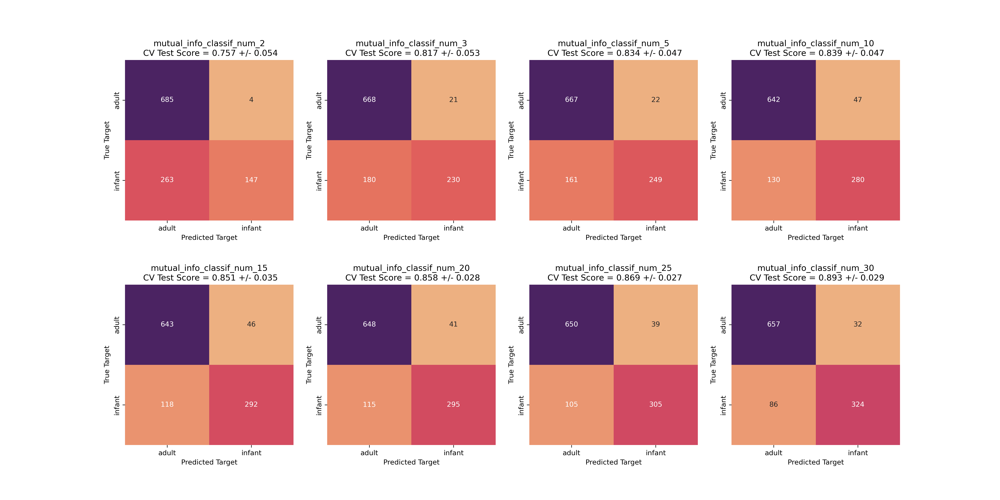
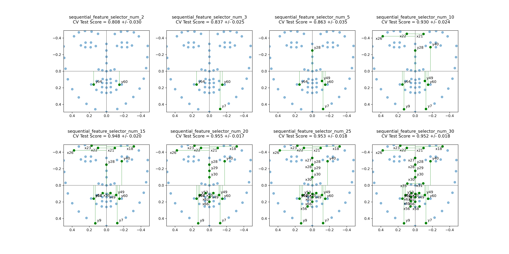
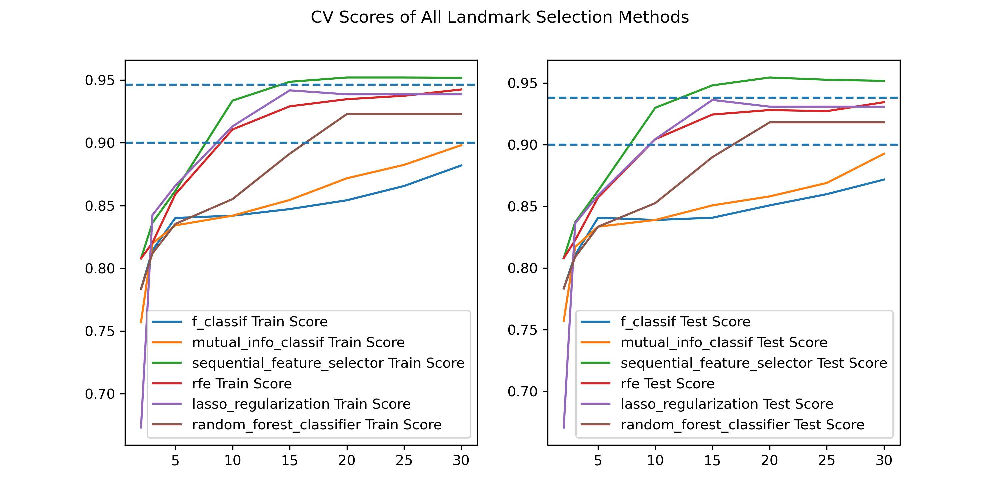
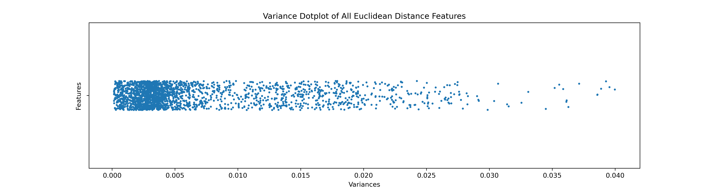
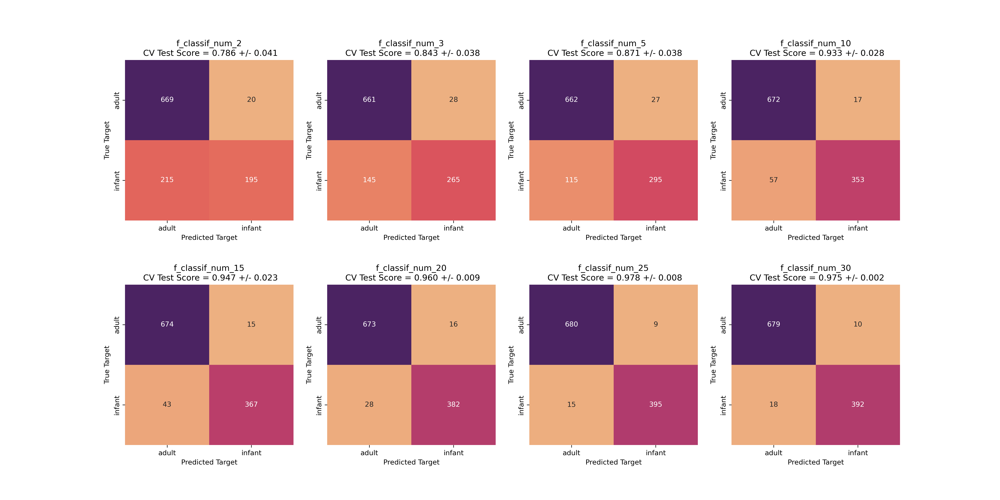
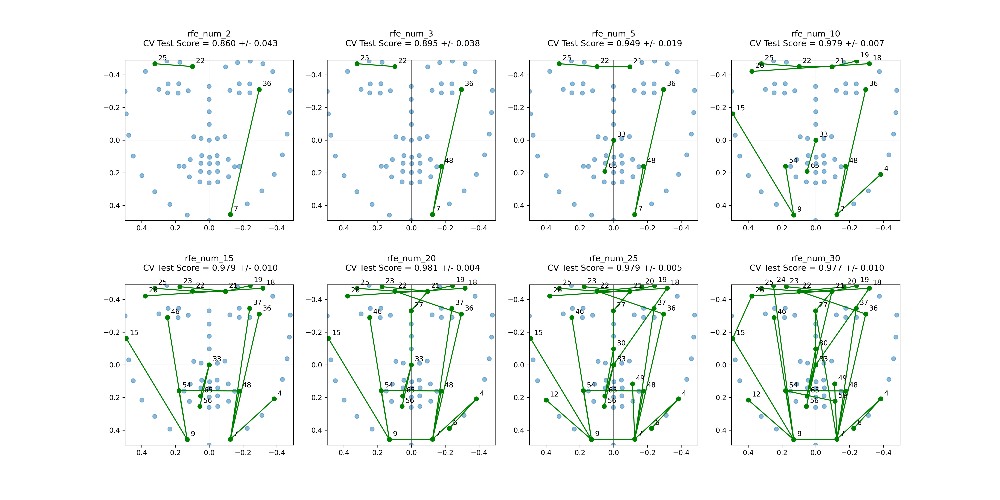

# Feature Selection

## Methods in Previous Project

**SVC**

- `PCA` to all landmark coordinates
- Manually select `boxratio` and `interoc_norm`

**Logistic Regression**

- Manually select `boxratio`
- `Forward Feature Selection` to all euclidean distances
- Combine `boxratio` and results in the 2nd step

**Bayes**

- `LDA`, `QDA`, `Gaussian Naive Bayes` to all landmark coordinates

## Data Source and Preprocessing

## Feature Selection Results (Landmarks)

### Variance Threshold

### Correlation Threshold

### Filter Methods

Filter methods use statistical measures to rank the features according to their relevance to the target variable. Examples of filter methods include `correlation-based feature selection`, `mutual information-based feature selection`, and `chi-squared feature selection`.

**Fisher's Score**

**Information Gain**

### Wrapper methods

Wrapper methods use a specific learning algorithm to evaluate the usefulness of subsets of features. Examples of wrapper methods include `recursive feature elimination`, `forward selection`, and `backward elimination`.

**Forward Feature Selection**

**Recursive Feature Elimination**

### Regularization methods

Regularization methods add a penalty term to the objective function that encourages sparse solutions, i.e., solutions with fewer non-zero coefficients. Examples of regularization methods include `L1 regularization (Lasso)` and `L2 regularization (Ridge Regression)`.

**L1 Regularization (Lasso)**

### Tree-based methods

Tree-based methods like `Random Forest` and `Gradient Boosting` can be used to rank the importance of features based on how much they contribute to the reduction in impurity or error in the decision trees.

**Random Forests**

### Conclusion

## Feature Selection Results (Euclidean Distances)

### Variance Threshold

### Correlation Threshold

### Fisher's Score

### Information Gain

### Forward Feature Selection 

### Recursive Feature Elimination

### LASSO Regularization

### Random Forests

### Conclusion

