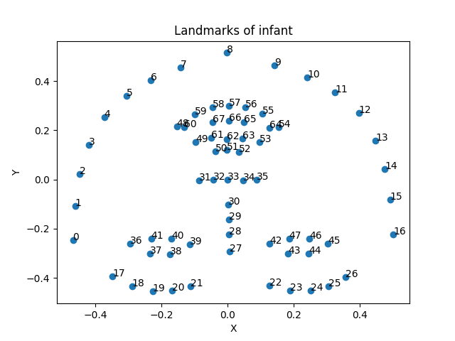
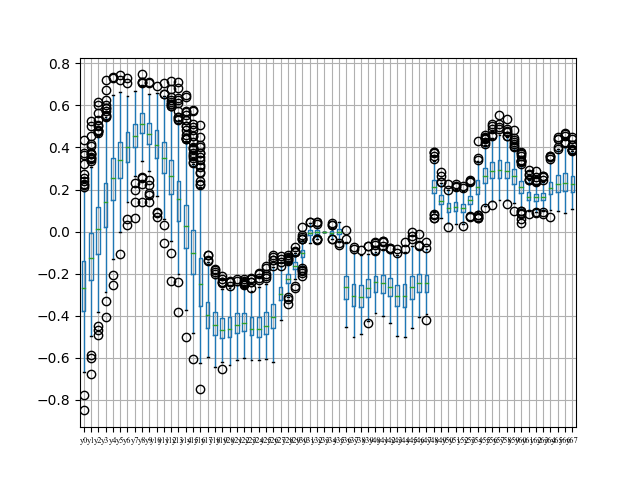
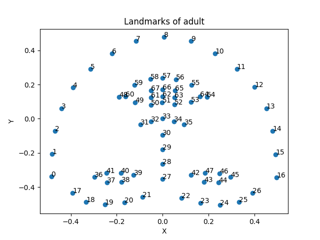
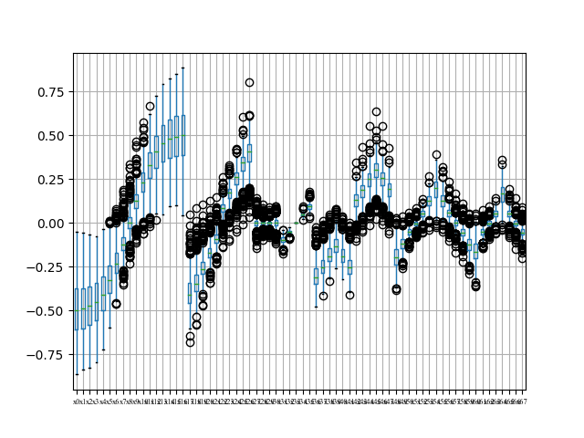
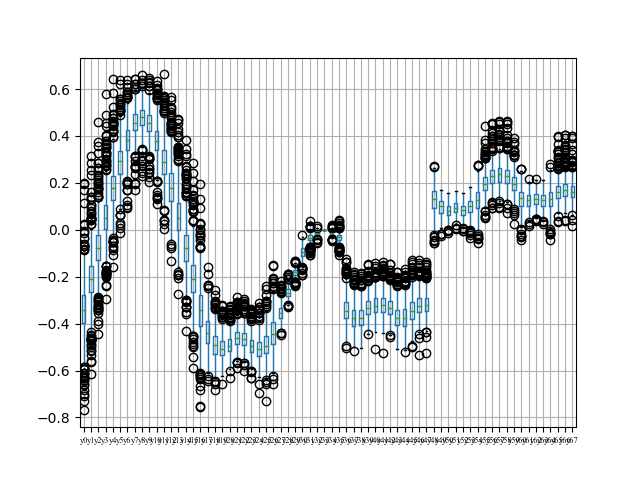

# Investigating the Best Way to Select Outliers

## Introduction

Outliers are exceptional records that are significantly different from the rest of the data. Commonly, they can lead to incorrect conclusions or predictions and will have an impact on further research. Therefore, outliers selection is an important part of data analysis and a step we must go through before using model to train or test. Considering the multidimensional data, Mahalanobis distance and Isolation Forest are two commonly used techniques for identifying outliers in landmarks data. In this approach, we utilize these two techniques to detect outliers and validate the model's accuracy using noise data.  

## Data Analysis  

### Mean, median, standard deviation, and range for each variable
To gain insights into the distribution of our data, we performed a data analysis by calculating the mean, median, standard deviation, and range for each variable. 

The data source is `merged_landmarks`. The shapes of the infant dataset and adult dataset are (410, 136) (689, 136) respectively.

```agsl
python src/scatter.py
Column x0: Mean=-0.47, Median=-0.48, Std=0.21, Range=1.06
Column y0: Mean=-0.25, Median=-0.27, Std=0.19, Range=1.29
Column x1: Mean=-0.46, Median=-0.48, Std=0.20, Range=1.06
Column y1: Mean=-0.11, Median=-0.12, Std=0.18, Range=1.20
……
```
We can get the completed result by using the command 'make scatter'.
Here is the analysis of the 68 facial landmark points.
1. Mean: The average x-coordinate of all the 68 points is 375.97, and the average y-coordinate is  0.513.
2. Median: The median x-coordinate is 0.410, and the median y-coordinate is 0.515.
3. Standard deviation: The standard deviation of the x-coordinates is 0.229, and the standard deviation of the y-coordinates is 0.189.
4. Range: The range of the x-coordinates is  0.777 (from 0.064 to 0.841), and the range of the y-coordinates is from 0.570 (from 0.142 to 0.712).   
Based on these values, we can see that the mean and median values for both x and y coordinates are relatively close, indicating a roughly symmetrical distribution. The standard deviation values are relatively small, suggesting that the data points are tightly clustered around the mean. The range values show that the x and y coordinates have different levels of variability, with the x values having a wider range than the y values.

### Visualization
Additionally, we created boxplot and scatterplot for each variable to visualize their distribution. Boxplots help visualize the distribution of each variable, while scatterplots show the relationship between individual data points.

#### Facial landmarks distribution of infants (values taken as the mean of each landmark)
<div align="center">



</div>

#### Boxplot of infant_x
<div align="center">


</div>

#### Boxplot of infant_y
<div align="center">


</div>

#### Facial landmarks distribution of adults (values taken as the mean of each landmark)
<div align="center">


</div>

#### Boxplot of adult_x
<div align="center">


</div>

#### Boxplot of adult_y
<div align="center">


</div>

### Using two models to detect outliers
The approach we take for detecting outliers involves the use of Mahalanobis distance, and Isolation Forest.Mahalanobis distance to determine the similarity or dissimilarity between data points by scaling the difference by the inverse of the covariance matrix, and then taking the square root of the result to produces a single value that represents the distance between the two points in the multi-dimensional space. During the process,  we compute the Mahalanobis distance for each data point, which measures the distance between a point and a distribution, taking into account the covariance structure of the dataset.Isolation Forest is an anomaly detection algorithm based on tree structures that can detect anomalous data points in a short time. It achieves this by building decision trees with random splits in the dataset, where each tree is a recursive process of dividing the dataset into subsets. During the process, it partitions the dataset into smaller and smaller subspaces until the anomalous points are isolated.  

The results are as follows.

#### __Mahalanobis distance__

```agsl
Data:
infant_outlier:
Outliers: Int64Index([  3,  10,  13,  22,  32,  35,  38,  41,  68,  80,  81,  89,  98,
             99, 109, 142, 239, 277, 335, 381],
           dtype='int64')
adult_outlier:
Outliers: Int64Index([ 21,  28,  40,  55,  66,  76, 149, 167, 170, 180, 226, 244, 269,
            284, 296, 339, 345, 371, 388, 422, 531, 594, 624, 625, 626, 651,
            657, 665, 667, 677, 681, 682],
           dtype='int64')
```


#### __Isolation Forest__

```agsl
Data:
infant_outlier:
[  3  10  12  13  68  69  80  81  99 142 183 241 258 268 286 288 299 323
 329 364]
adult_outlier:
[ 15  21  28  40 109 163 167 180 226 248 269 284 296 331 335 339 344 355
 356 371 382 395 422 489 574 624 636 651 657 665 667 681]
```

    
### Assessing the Feasibility of Applying the Model for Outlier

To determine if the results identified by our model are true outliers, we need an appropriate criterion for validation. However, in the absence of such a criterion, we added some noise points to the dataset to test the feasibility of our model. We examined whether the Mahalanobis distance and Isolation Forest techniques could detect these noise points as outliers. If the model is able to identify the noise points as outliers, it would suggest that our analysis is feasible. Conversely, if the model fails to identify the noise points as outliers, it would indicate that our approach may not be effective for outlier detection. By conducting this validation process, we can ensure that our model is robust and reliable in detecting outliers, even in the presence of noise and other irregularities in the data.

Based on the previous analysis of the landmarks data, we observed that all the x and y coordinates were within the range of [-1,1]. Therefore, we added noise points to the dataset with values also restricted to the same range. The proportion of noise points added was set to 5% of the original dataset, resulting in the addition of 20 noise points to the infant dataset and 34 noise points to the adult dataset. The dimensions of the original and modified datasets are as follows: the infant dataset had a dimension of (410, 136) and after adding the noise points, it became (689, 136). Similarly, the adult dataset had a dimension of (430, 136) and became (723, 136) after the addition of noise points. The noise rows index are 411-430 , 690-723 respectively. By incorporating these noise points into the dataset, we can evaluate the effectiveness of our outlier detection model in the presence of noise and ensure that it is robust and reliable in identifying outliers even in more complex datasets.

In summary, the data distribution is as follows.

<div align="center">

|    | noise index | other index(correct index) |
| ---- | ---- | ---- |
| infant | 410-429 | 0-409 |
| adult | 689-722 | 0-688|

</div>

After using two methods, the results are as follows (copy from terminal).

#### __Mahalanobis distance__

```agsl
Use Mahalanobis:
Test the method with noise:
infant_outlier:
[410 411 412 413 414 415 416 417 418 419 420 421 422 423 424 425 426 427
 428 429]
adult_outlier:
[689 690 691 692 693 694 695 696 697 698 699 700 701 702 703 704 705 706
 707 708 709 710 711 712 713 714 715 716 717 718 719 720 721 722]
```


#### __Isolation Forest__

```agsl
Use isolation tree:
Test the method with noise:
infant_outlier:
Outliers: Int64Index([410, 411, 412, 413, 414, 415, 416, 417, 418, 419, 420, 421, 422,
            423, 424, 425, 426, 427, 428, 429],
           dtype='int64')
adult_outlier:
Outliers: Int64Index([689, 690, 691, 692, 693, 694, 695, 696, 697, 698, 699, 700, 701,
            702, 703, 704, 705, 706, 707, 708, 709, 710, 711, 712, 713, 714,
            715, 716, 717, 718, 719, 720, 721, 722],
           dtype='int64')

```

<div align="center">

| dataset=infant/adult | Mahalanobis distance | Isolation Forest |
|----------------------|----------------------|------------------|
| ACC /P/R/F1          | 1                    | 1                |
</div>


### Others related

In addition to using landmarks data, we also evaluate efficiency of three scaling techniques by using our two outlier detection model on datasets obtained from these methods.

The data distribution is the same as before.
<div align="center">

|    | noise index | other index(correct index) |
| ---- | ---- | ---- |
| infant | 410-429 | 0-409 |
| adult | 689-722 | 0-688|

</div>

Results are as follows.

#### Standard

```agsl
Use isolation tree:
Test the method with noise:
infant_outlier:
Outliers: Int64Index([410, 411, 412, 413, 414, 415, 416, 417, 418, 419, 420, 421, 422,
            423, 424, 425, 426, 427, 428, 429],
           dtype='int64')
adult_outlier:
Outliers: Int64Index([689, 690, 691, 692, 693, 694, 695, 696, 697, 698, 699, 700, 701,
            702, 703, 704, 705, 706, 707, 708, 709, 710, 711, 712, 713, 714,
            715, 716, 717, 718, 719, 720, 721, 722],
           dtype='int64')
------------------------------------------------------------
Use Mahalanobis:
Test the method with noise:
infant_outlier:
[410 411 412 413 414 415 416 417 418 419 420 421 422 423 424 425 426 427
 428 429]
adult_outlier:
[689 690 691 692 693 694 695 696 697 698 699 700 701 702 703 704 705 706
 707 708 709 710 711 712 713 714 715 716 717 718 719 720 721 722]
```

#### Normalized

```agsl
Use isolation tree:
Test the method with noise:
infant_outlier:
Outliers: Int64Index([410, 411, 412, 413, 414, 415, 416, 417, 418, 419, 420, 421, 422,
            423, 424, 425, 426, 427, 428, 429],
           dtype='int64')
adult_outlier:
Outliers: Int64Index([689, 690, 691, 692, 693, 694, 695, 696, 697, 698, 699, 700, 701,
            702, 703, 704, 705, 706, 707, 708, 709, 710, 711, 712, 713, 714,
            715, 716, 717, 718, 719, 720, 721, 722],
           dtype='int64')
------------------------------------------------------------
Use Mahalanobis:
Test the method with noise:
infant_outlier:
[410 411 412 413 414 415 416 417 418 419 420 421 422 423 424 425 426 427
 428 429]
adult_outlier:
[689 690 691 692 693 694 695 696 697 698 699 700 701 702 703 704 705 706
 707 708 709 710 711 712 713 714 715 716 717 718 719 720 721 722]
```

#### MDS

```agsl
Use isolation tree:
Test the method with noise:
infant_outlier:
Outliers: Int64Index([  9,  26,  33,  47,  51,  67,  82, 145, 159, 167, 178, 202, 244,
            261, 272, 275, 281, 304, 308, 330],
           dtype='int64')
adult_outlier:
Outliers: Int64Index([ 18,  29,  93, 105, 107, 135, 166, 184, 188, 189, 200, 210, 212,
            224, 227, 230, 243, 266, 297, 307, 417, 419, 434, 435, 443, 445,
            447, 449, 465, 474, 617, 623, 628, 670],
           dtype='int64')
------------------------------------------------------------
Use Mahalanobis:
Test the method with noise:
infant_outlier:
[  0   9  10  26  33  76  82  99 159 178 202 244 272 275 281 288 330 331
 354 364]
adult_outlier:
[ 18  29  40  43  90 105 107 135 162 184 188 189 200 210 212 224 243 245
 266 301 373 419 434 435 437 447 449 465 556 574 617 623 624 628]
```


<div align="center">
                    
ACC/P/R/F1 

| dataset=infant/adult | Mahalanobis distance | Isolation Forest |
|----------------------|----------------------|------------------|
| Standard             | 1                    | 1                |
| Normalized           | 1                    | 1                |
| MDS                  | 0                    | 0                |

</div>
We can conclude that standard scaling and normalization scaling are very effective, but MDS scaling is too bad. 

## Conclusion

Based on the results, we found that both the Mahalanobis distance and Isolation Forest techniques were effective in identifying the added noise points accurately, without falsely flagging any of the true data points as outliers. These findings suggest that our outlier detection method using landmarks data is viable and can accurately identify outliers in complex datasets, even in the presence of noise. 
