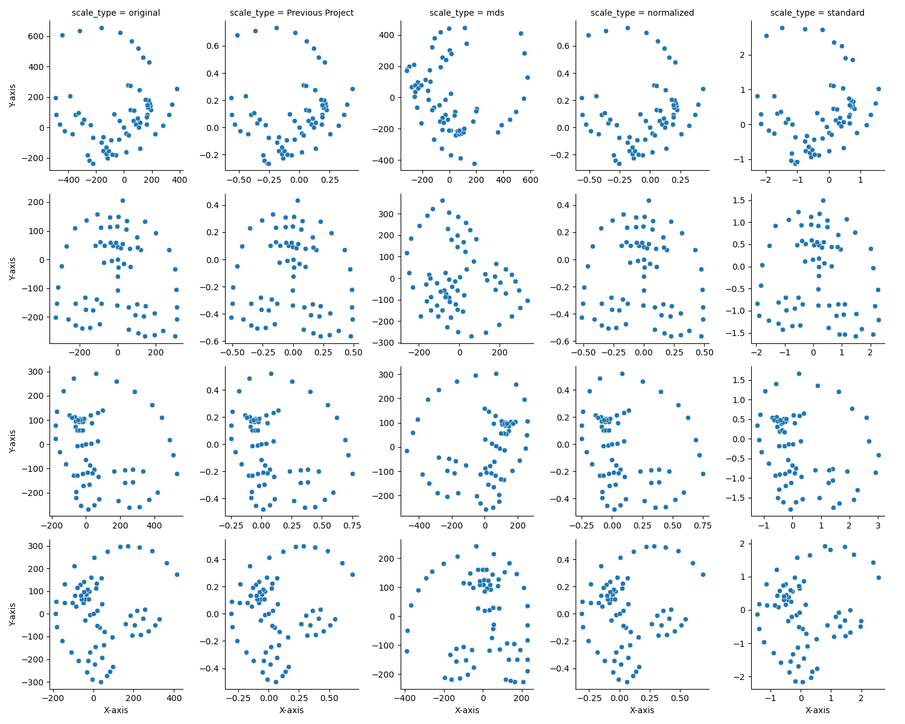

# Overview of the Whole Project

## Introduction

The project focused on the Computer Vision project in course DS5110 in Spring 2023 semester, mainly on enhancing facial
landmark alignment, representation, and feature selection techniques in the context of computer vision and facial
recognition. Based on the [InfAnFace paper, Wan et al, (2022)](https://arxiv.org/abs/2110.08935) and
the [faces project](https://github.com/ds5110/faces), our work is divided into three main components: exploring various
scaling and rotation methods, outlier detection, and feature selection.

## Data Source

The original data used in this project is
the [Adult dataset](https://github.com/ostadabbas/Infant-Facial-Landmark-Detection-and-Tracking/raw/master/data/300w/300w_valid.csv)
and the [Infant dataset](https://coe.northeastern.edu/Research/AClab/InfAnFace/labels.csv), which come from the research
by Dr. Wan, and another dataset comes from the faces project which normalized the data and rotated the landmarks in a
more effective way.

## Scale

In this part, we analyzed various scaling and rotation methods for facial landmarks. Our aim was to compare the original
scaling method with three alternative approaches and observe their effectiveness when applied to various studies. By
determining the most suitable scaling method, we hope to contribute to improved accuracy and efficiency in applications
like facial recognition, emotion detection, and computer vision tasks.

By the previous datasource, we applied center alignment and rotation on it according to the previous project, and for
all of 3 results, we applied 3 different scale methods: MDS, Standardization, and Normalization by Bounding Box on it.

1. **Figure 1**: Infant landmarks after aligning center

2. **Figure 2**: Adult landmarks after aligning center

3. **Figure 3**: Infant landmarks after Rotation

4. **Figure 4**: Adult landmarks after Rotation

You could find more details of these scale methods in [scale.md](./scale.md).

We faced several challenges while working on the task of Scale. One challenge was the lack of detailed information about
the scaling methods used in the previous project. It took considerable time to identify the exact methods and understand
the processed data and its end results. Another challenge was determining how to compare the effects of different
scaling methods. This proved to be quite difficult, and we ultimately did not find a definitive solution. Instead, we
were able to rule out two methods by verifying that they were not suitable for our specific scenario.

In this section, we conducted a comprehensive analysis of various scaling and rotation techniques for facial landmarks,
juxtaposing the conventional method with three alternative approaches: Multidimensional Scaling (MDS), Standardization,
and Normalization by Bounding Box. Our investigation revealed that MDS and Standardization were ill-suited for this
purpose, as they failed to establish a fixed point on the face, consequently leading to disorder in subsequent research.
An optimal scaling technique for facial landmarks should facilitate their alignment to the center and enable a
reasonable rotation while maintaining normalization, as this ensures stability of the center and rotation parameters.

## Outlier

Outliers are exceptional records that are significantly different from the rest of the data. Commonly, they can lead to
incorrect conclusions or predictions and will have an impact on further research. Therefore, outliers selection is an
important part of data analysis and a step we must go through before using model to train or test. Considering the
multidimensional data, Mahalanobis distance and Isolation Forest are two commonly used techniques for identifying
outliers in landmarks data. In this approach, we utilize these two techniques to detect outliers and validate the
model's accuracy using noise data.

We applied Mean, median, standard deviation, and range for each variable and try to gain some insights from the
distribution of them. The datasource we used is the `merged_landmarks` which is the dataset coming from previous project
and being aligned center and rotated. By them, there is an image that plot by the mean value of each landmark:

The scatter plots show the mean location of each landmark point in the image. Based on the scatter plots, it appears that the landmark points for infants and adults are distributed differently. For example, some of the landmark points for infants appear to be closer together, while others are more spread out. In contrast, the landmark points for adults appear to be more evenly distributed across the image.

The box plots provide a summary of the distribution of x and y coordinates for each landmark point. Based on the box plots, it appears that the distribution of landmark points for infants and adults is also different. For example, some of the landmark points for infants have a larger range of x and y coordinates than others, indicating greater variability in their location across images. In contrast, the landmark points for adults have a more consistent range of x and y coordinates across images.

After that, we take 2 approaches we take for detecting outliers involves the use of Mahalanobis distance, and Isolation
Forest. After adding some noises to the dataset, we could get such a result:

| dataset=infant/adult（ACC /P/R/F1 ） | Mahalanobis distance | Isolation Forest |
|------------------------------------|----------------------|------------------|
| Standard                           | 1                    | 1                |
| Normalized                         | 1                    | 1                |
| MDS                                | 0                    | 0                |
| Previous Project                   | 1                    | 1                |

You could find more details of these scale methods in [outlier.md](./outlier.md).

Based on the results, we found that both the Mahalanobis distance and Isolation Forest techniques were effective in
identifying the added noise points accurately, without falsely flagging any of the true data points as outliers. These
findings suggest that our outlier detection method using landmarks data is viable and can accurately identify outliers
in complex datasets, even in the presence of noise.

## Feature Selection

During the previous project, three different models were applied to make the adult-infant classification. They adopted
various `feature selection` or `dimension reduction` methods before fitting features to each model.

In this project, we decided to apply several different feature selection methods to both **landmark coordinates** and **
Euclidean Distances** between them. Our purpose is to compare differences between the various feature selection methods,
and their effects on the final model performance. `Logistic Regression` was selected as our classification model, which
has been approved to have a good performance in the last project using a few distances.

A total number of 6 methods were applied, including `Fisher's Score`, `Information Gain`, `Forward Feature Selection`
, `Recursive Feature Elimination`, `Lasso Regularization`, and `Random Forests`. In addition, we
applied `Variance Threshold` and `Correlation Threshold` to filter features before implementing selection methods.

The plots show the train and test scores of all methods. For landmark coordinate features, `Forward Feature Selection`
performs best and can get a better test score than classification without feature selection, which means the reduction
of overfitting extent. For Euclidean Distance selection, the performance of all methods is better than landmark
selection. All features can get a test score of 0.9 with fewer features (less than 10 features). `FFS` still performs
best, and it reaches higher test scores than ones without feature selection, which means a reduction of overfitting.
Filter Methods generally perform worse than wrapper and regularization methods.

The plots of running time show that wrapper methods are much slower than others, especially when the number of features
in the dataset is big. `FFS` for Euclidean Distances can take up to hundreds of seconds. Combined with the performance
above, we would say that although `FFS` has the best test score of classification, it is really computationally
expensive. Both `RFE` and `Lasso` would be better choices that are relatively fast and performs well.

At last, we put all "good" feature selection results together that have relatively good performance (test score higher
than or around 0.9) and have the least number of features using that method, to see if some features are treated as
important ones commonly among all methods.

For landmark coordinates features, most "good" results put importance on y-coordinates of mouth, jaw, and eyes, and
x-coordinates of eyebrows. While for Euclidean Distances, most "good" results put importance on eye-nose, eye-jaw,
mouth-jaw, and eyebrows distances. Among all 68 landmarks of one face, we can see the most important features are mouth,
eye, nose, jaw, and distances between them. And distances can get a good performance with fewer feature numbers than
coordinates. Nearly no landmarks of cheeks are chosen among all methods.

## Stakeholder Feedback (03/28/2023)

- feedback regarding scaling methods

The end goal of choosing a better scaling method should be more clear.

- feedback regarding outlier detection

We should know what an outlier looks like, e.g. landmark dots cannot make up a face. And how they can be detected.

Current generic algorithms for detecting outliers may not correctly mean there is no outlier. The applied metrics may
not detect the bias, or the metrics may not correspond to the outlier that we tended to look for.

The current landmark results should be reasonable as they have checked them. However, We can put in an outlier on
purpose to test whether the detector can detect the outlier.

Instead of using euclidean distances as outlier detection features, try only using normalized coordinates (
68-dimensional vector).

Apply PCA to coordinates, and see what the left face shape and the left data look like. Then think about whether the
data after PCA is outliers.

- other feedback

Don't focus too much on implementing classification algorithms but on understanding the nature of data.

## Challenges

Throughout the course of this project, we faced several challenges. One challenge was the initial uncertainty about how
the DS project should be approached. We were unsure about the specific direction and scope of the project. In this
regard, we would like to thank ChatGPT and the OpenAI company behind it for providing guidance on how to carry out a
project effectively.

Another challenge was determining the direction to take in our research. We initially chose to enrich the methods of
Scale and other aspects. During a check-in with our Stakeholder, we received suggestions to compare our work with the
original project. This feedback helped us refine our direction, focusing on extending a few aspects that were not
thoroughly explored in the original project.

Time management was also a challenge. By the time we fully confirmed our research direction, there was limited time
remaining to complete the project. This constraint required us to work overtime and put in extra effort to ensure that
we met our goals and delivered a high-quality output.

## Conclusion

In cnoclusion, our project aimed to improve facial landmark scale, representation, and feature selection in computer
vision and facial recognition. We explored scaling and rotation methods, outlier detection techniques, and feature
selection strategies. The optimal scaling technique should align landmarks to the center, enable rotation, and maintain
normalization. Mahalanobis distance and Isolation Forest were effective in detecting outliers, and using Euclidean
distances led to better performance with fewer features. Forward Feature Selection, Recursive Feature Elimination, and
Lasso Regularization were suitable for feature selection. Our work contributes to enhancing facial recognition and
computer vision tasks by providing a more accurate and efficient framework.