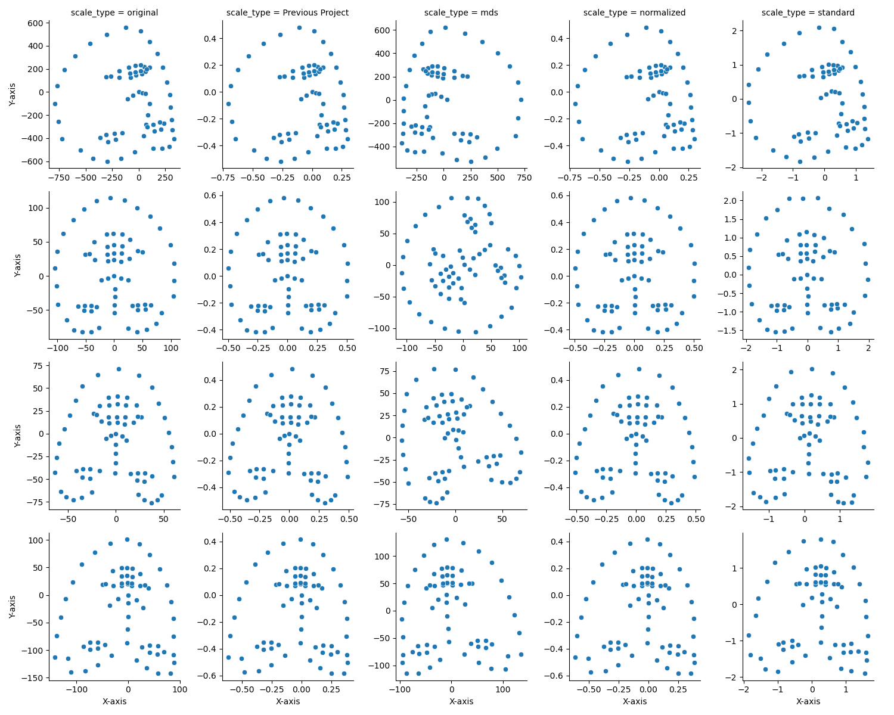

### Introduction

This project focuses on analyzing an existing facial landmarks dataset and exploring the impact of different scaling
methods on subsequent analysis. Our aim was to compare the original scaling method with three alternative approaches and
observe their effectiveness when applied to various studies. By determining the most suitable scaling method, we hope to
contribute to improved accuracy and efficiency in applications like facial recognition, emotion detection, and computer
vision tasks.

### Dataset and Methods

The dataset under analysis contains facial landmarks from hundreds of images, each comprising 68 distinct landmarks
represented by their x and y coordinates. We began by examining the original scaling method, which utilized the No.33
landmark (nose) as the center and scaled the landmarks based on the range of the axis value.

To explore alternative scaling methods, we applied three new approaches:

1. **Multidimensional Scaling (MDS)**: Applied using `sklearn.manifold.MDS`(“sklearn.manifold.MDS”).
2. **Standardization**: Implemented using `sklearn.preprocessing.StandardScaler`(“Sklearn.Preprocessing.StandardScaler”)
   .
3. **Normalization by Bounding Box**: Landmarks were scaled based on the bounding box of the face, using separate x and
   y ranges.

The rationale behind selecting these methods was to investigate the effectiveness of various scaling techniques in
aligning and representing facial landmarks, ultimately enabling more accurate analysis in different studies.

### Center Alignment and Scaling

Similarly, with the previous project, we performed center alignment using the No.33 landmark (nose) as the center.

After aligning the landmarks, we applied the above three scaling methods to the centered landmarks too. Each of these
scaling methods was applied to the dataset to explore their impact on the alignment and representation of
facial landmarks, with the ultimate goal of identifying the most suitable method for various studies in the field.

### Center Alignment, Scaling, and Rotation

After applying center alignment and scaling to the facial landmarks, the previous project introduced a rotation method
to further enhance their representation. With applying the above 3 scale methods to the rotation data, we obtained
another CSV file containing 3 scaling types, previous project data, and original data. This further enhances our
analysis of the impact of various scaling and rotation methods on the alignment and representation of facial landmarks
in different studies.

### Visualization and Analysis

We generated visualizations to better understand the impact of the scaling and rotation methods on the facial landmarks.
Four figures were plotted, showcasing the alignment and representation of the landmarks for different methods:

1. **Figure 1**: Infant landmarks after aligning center

2. **Figure 2**: Adult landmarks after aligning center

3. **Figure 3**: Infant landmarks after Rotation

4. **Figure 4**: Adult landmarks after Rotation

From the visualizations, we observed that the MDS scaling method altered the face orientation, making it unsuitable for
our objective. Similarly, the Standardization method was found to be unsuitable due to its use of the mean as the zero
point. The other two methods (excluding Original) showed similar results, making it challenging to determine which one
is superior. These visualizations aid in understanding the effectiveness of each scaling and rotation method on the
alignment and representation of facial landmarks, providing valuable insights for future work and applications.

### Comparison with Previous Project

In comparison to the previous project, our project retained the initial two preprocessing steps, aligning the center and
rotation, to ensure minimal influence on the outcome. We experimented with alternative scaling methods, including MDS,
standardization, and a different normalization approach. We discovered that MDS resulted in varying face directions,
which increased complexity and rendered outlier detection ineffective. Standardization maintained the face direction but
shifted the center slightly, yielding similar results. Normalization by bounding box provided more reasonable landmarks,
and despite the minor differences, it proved to be the best method for keeping the landmarks in an organized range.
Thus, scaling indeed impacts the outcome significantly, and the normalization method is the most effective choice for
maintaining an organized landmarks after aligning and rotation.

### Conclusion and Future Work

In this section, we analyzed various scaling and rotation methods for facial landmarks, comparing the original method
with three alternatives: MDS, Standardization, and Normalization by Bounding Box. The MDS method was found to be
unsuitable, as was Standardization due to its use of the mean as the zero point. The other methods yielded similar
results, making it challenging to determine the most effective approach.

### References

1. “sklearn.manifold.MDS.” *Scikit-learn*, scikit-learn.org/stable/modules/generated/sklearn.manifold.MDS.html.
2. “Sklearn.Preprocessing.StandardScaler.” *Scikit-learn*,
   scikit-learn.org/stable/modules/generated/sklearn.preprocessing.StandardScaler.html.
