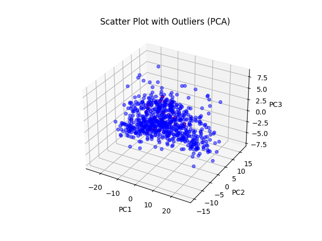
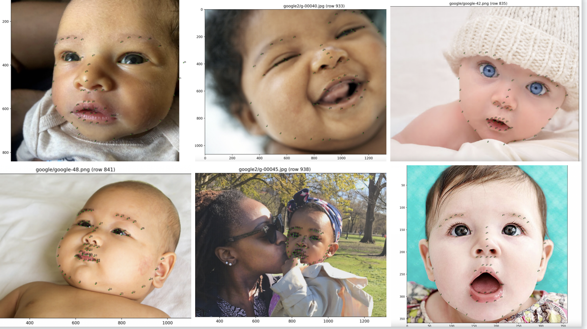
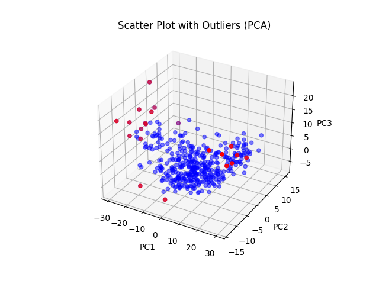
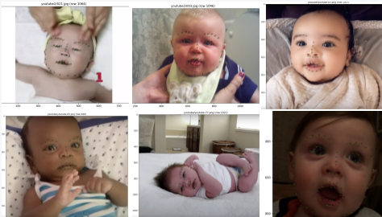
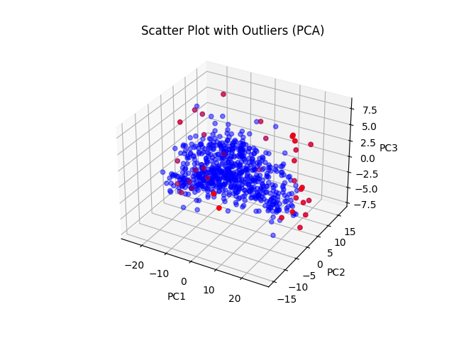

# Investigating the Best Way to Scale Landmarks

## Introduction

Outliers are exceptional records that are significantly different from the rest of the data. Commonly, they can lead to incorrect conclusions or predictions and will have an impact on further research. Therefore, outliers selection is an important part of data analysis and a step we must go through before using model to train or test. Considering the data is multidimensional, we use Mahalanobis distance and Isolation Forest.

## Approach

The distance between each pair of two landmarks is important for our subsequent study, so we calculated the distance between two landmarks for 68 landmarks. The result is `euclidean_part_infant.csv` and `euclidean_part_adult.csv`.
And then, we use two methods mentioned above to select outliers considering the data is multi-dimensional.

**Infant Comparison**

-Mahalanobis distance  
`ma_infant.py` uses Mahalanobis distance to determine the similarity or dissimilarity between data points by scaling the difference by the inverse of the covariance matrix, and then taking the square root of the result to produces a single value that represents the distance between the two points in the multi-dimensional space.  
1 outliers index shown in the terminal  
2 filtered data saved in the `filtered_infant_ma.csv`  
3 a scatter plot of all features to visualize the data and outliers shown in the `ma_infant.png`
  
note:For data with 2278 columns, we cannot directly plot a scatter plot of all features
to visualize the data and outliers. One possible approach is to use principal component
analysis (PCA) to project the data into a lower dimensional space and visualize
the data points in this space.  

To verify that the results of this method are correct, we display part of the selected outliers' pictures with landmarks.
normal:
outliers:

Based on the displayed results, the outliers are not significantly different from the normal one, then i decide to abandon the use of outlier detection and use all the data for analysis.

-Isolation Forest  
`isolation_forest_infant.py`uses Isolation Forest . It is an anomaly detection algorithm based on tree structures that can detect anomalous data points in a short time. Isolation Forest achieves this by building decision trees with random splits in the dataset, where each tree is a recursive process of dividing the dataset into subsets.
1 outliers index shown in the terminal  
2 filtered data saved in the `filtered_infant_if.csv`  
3 a scatter plot of all features to visualize the data and outliers shown in the `isolation_forest_infant.png`

note:For data with 2278 columns, we cannot directly plot a scatter plot of all features
to visualize the data and outliers. One possible approach is to use principal component
analysis (PCA) to project the data into a lower dimensional space and visualize
the data points in this space.

To verify that the results of this method are correct, we display part of the selected outliers' pictures with landmarks.
normal:
outliers:

Based on the displayed results, the outliers are not significantly different from the normal one, then i decide to abandon the use of outlier detection and use all the data for analysis.

**Adult Comparison**
-Mahalanobis distance  
`ma_adult.py` 
1 outliers index shown in the terminal  
2 filtered data saved in the `filtered_adult_ma.csv`  
3 a scatter plot of all features to visualize the data and outliers shown in the `ma_infant.png`

The verification process is the same before.   

-Isolation Forest  
`isolation_forest_infant.py`  
1 outliers index shown in the terminal  
2 filtered data saved in the `filtered_adult_if.csv`  
3 a scatter plot of all features to visualize the data and outliers shown in the `isolation_forest_adult.png`

The verification process is the same before. 

## Conclusion

In the process of selecting outliers, we used two methods, which are Mahalanobis distance and Isolation Forest, to detect outliers in our dataset.  
After applying both methods, we get some outliers. We consider that the outliers may represent valid and meaningful data points that should not be discarded without careful consideration.   
After displaying, we found that the outliers detected by either method did not show any clear distinction from the normal values. As a result, we decided to use all the data and abandon the outliers.  
