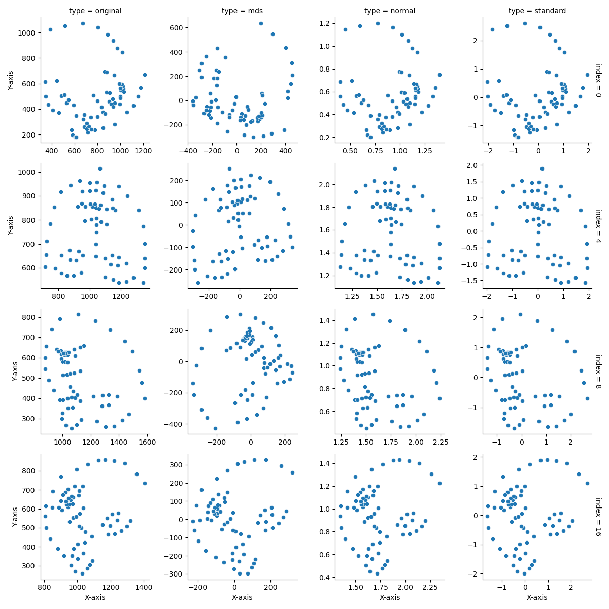
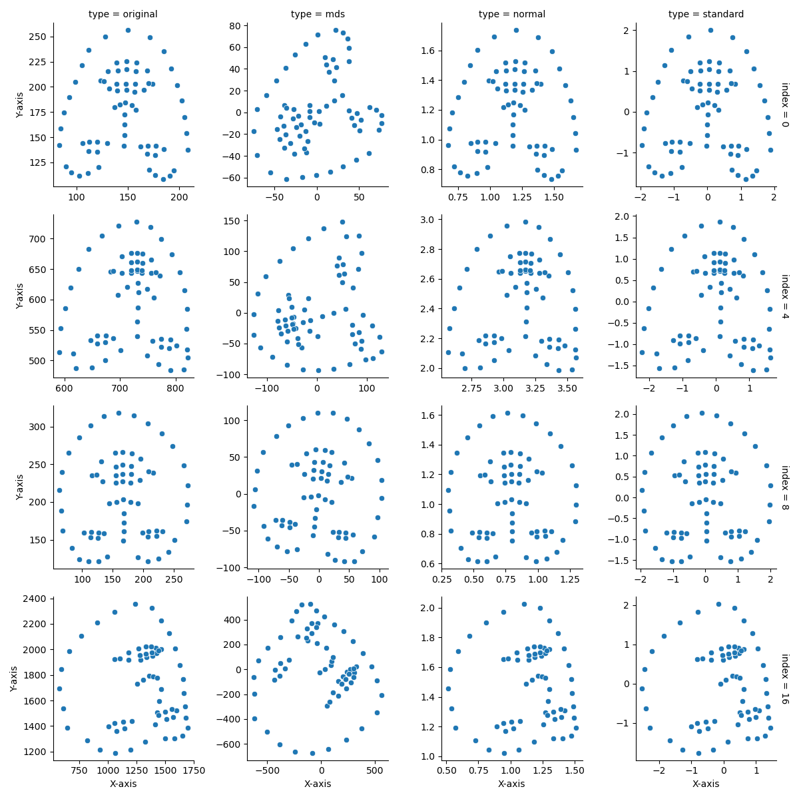

# Investigating the Best Way to Scale Landmarks

## Introduction

The scaling of landmarks is an important step in our image processing tasks. In this part of our project, three
different scaling approaches were used, including standardization, normalization by face bounding box, and
Multidimensional scaling. The objective of this study was to find the best way to scale landmarks that would keep the
range of landmarks within a similar distance while maintaining constant relative distances between landmarks. The
Min-Max Scale and Unit Vector Scale approaches were also considered but were found unsuitable for the given usage
scenario.

## Approach

For standardization, the `sklearn.preprocessing.StandardScaler` was used to normalize the landmarks of each image
separately. In normalization by face bounding box approach, the x-axis width and y-axis width occupied by the landmarks
were calculated as the denominator, while the coordinates of all points/related widths were used as the numerator to
normalize the coordinates. The Multidimensional scaling approach used `sklearn.manifold.MDS` to perform the scaling on
the landmarks of each image.

**Infant Comparison**

**Adult Comparison**

## Conclusion

As we can see, the Standard method has the lowest distance, and the MDS has a better performance, but it causes the
image to flip and does not meet our requirements, so it is dropped. Between Standard and Normalized, we choose the
Standard method, which has a smaller distance difference.

