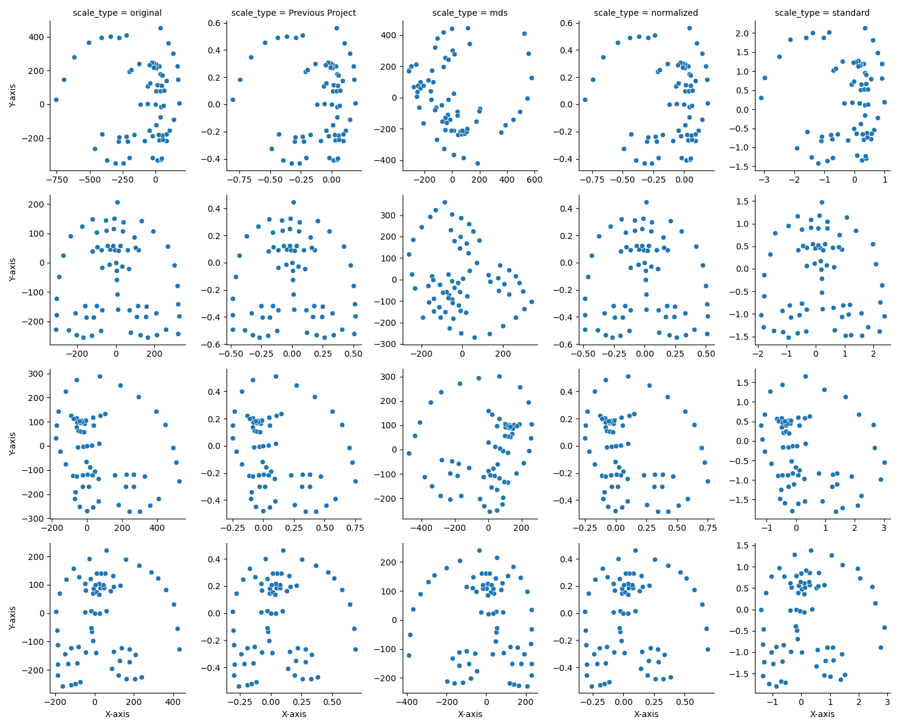
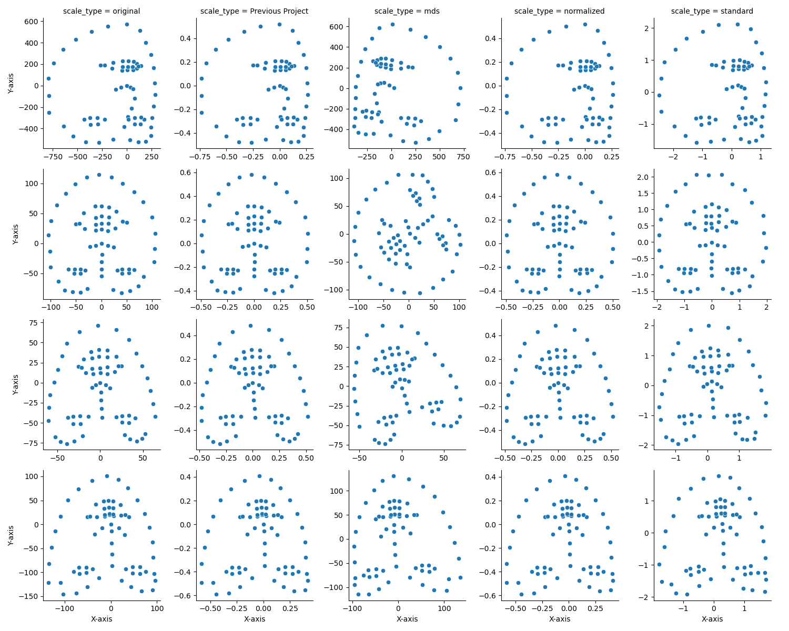

### Introduction

This project focuses on analyzing an existing facial landmarks dataset and exploring the impact of different scaling
methods on subsequent analysis. Our aim was to compare the original scaling method with three alternative approaches and
observe their effectiveness when applied to various studies. By determining the most suitable scaling method, we hope to
contribute to improved accuracy and efficiency in applications like facial recognition, emotion detection, and computer
vision tasks.

### Dataset and Methods

The dataset under analysis contains facial landmarks from hundreds of images, each comprising 68 distinct landmarks
represented by their x and y coordinates. We began by examining the original scaling method, which utilized the No.33
landmark (nose) as the center and scaled the landmarks based on the range of the axis value. The original scale formula
is as follows:

$$
\begin{align}
& sx_i=(x_i - x_{33})/range\\
& sy_i=(y_i - y_{33})/range\\
& range = (max(X \cup Y) - min(X \cup Y))\\
\end{align}
$$

To explore alternative scaling methods, we implemented three new approaches:

1. **Multidimensional Scaling (MDS)**: Applied using `sklearn.manifold.MDS`.
2. **Standardization**: Implemented using `sklearn.preprocessing.StandardScaler`.
3. **Normalization by Bounding Box**: Landmarks were scaled based on the bounding box of the face, using separate x and
   y ranges.

The rationale behind selecting these methods was to investigate the effectiveness of various scaling techniques in
aligning and representing facial landmarks, ultimately enabling more accurate analysis in different studies.

### Center Alignment and Scaling

Similarly, with the previous project, we performed center alignment using the No.33 landmark (nose) as the center. The
center alignment formula is:

$$
\begin{align}
sx_i=x_i - x_{33}\\
sy_i=y_i - y_{33}\\
\end{align}
$$

After aligning the landmarks, we applied three different scaling methods to the centered landmarks:

1. **Multidimensional Scaling (MDS)**: We used the `sklearn.manifold.MDS` implementation to perform multidimensional
   scaling on the centered landmarks. This technique aims to represent high-dimensional data in a lower-dimensional
   space while preserving the original pairwise distances between points as closely as possible.
2. **Standardization**: We applied the `sklearn.preprocessing.StandardScaler` to separately standardize the x and y
   coordinates of the centered landmarks. The StandardScaler transforms data to have zero mean and unit variance for
   each axis independently.

$$
\begin{align}
sx_i = \frac{x_i - \mu_x}{\sigma_x}\\
sy_i = \frac{y_i - \mu_y}{\sigma_y}\\
\end{align}
$$

3. **Normalization by Bounding Box**: We scaled the centered landmarks based on the bounding box of the face, using
   separate x and y ranges. The formula for this method is:

$$
\begin{align}
sx_i=(x_i - x_{33})/range_x\\
sy_i=(y_i - y_{33})/range_y\\
range_x = max(X) - min(X)\\
range_y = max(Y) - min(Y)\\
\end{align}
$$

Each of these scaling methods was applied to the dataset to explore their impact on the alignment and representation of
facial landmarks, with the ultimate goal of identifying the most suitable method for various studies in the field.

### Center Alignment, Scaling, and Rotation

After applying center alignment and scaling to the facial landmarks, the previous project introduced a rotation method
to further enhance their representation. The rotation process involves the following steps:

1. **Select Landmark Groups**: Choose two groups of landmarks for rotation calculation: `[36, 45], [39, 42]` (outer and
   inner eyecorners) and `[37, 44], [38, 43], [40, 47], [41, 46]` (upper and lower eyelids). These two groups were
   calculated separately.

2. **Calculate the Angle**: The angle was determined using the following formula:

   ```python
   xx = right_x - left_x
   yy = left_y - right_y (since the y coordinate is from up to down)
   hypots = np.hypot(xx, yy)
   weight = np.sum(hypots)
   x = np.sum(xx * hypots) / weight
   y = np.sum(yy * hypots) / weight
   angle = np.arctan(y / x)
   ```

   The code for this calculation can be found in `src/rotate_calculator.py`.

3. **Combine the Angles**:

   ```python
   weights = [len(groups) for all_group]
   angle = np.sum(angles * weights) / np.sum(weights)
   ```


4. **Compute New Coordinates**: Calculate the new coordinates after applying the rotation:

   ```python
   rotx = np.array([[cos, sin], [-sin, cos]])
   coords = coords @ rotx
   ```

With the addition of rotation to the center alignment and scaling methods, we obtained another CSV file containing 3
different scaling types, previous project data, and original data. This further enhances our analysis of the impact of
various scaling and rotation methods on the alignment and representation of facial landmarks in different studies.

### Visualization and Analysis

We generated visualizations to better understand the impact of the scaling and rotation methods on the facial landmarks.
Four figures were plotted, showcasing the alignment and representation of the landmarks for different methods:

1. **Figure 1**: Infant landmarks after aligning center


2. **Figure 2**: Adult landmarks after aligning center


3. **Figure 3**: Infant landmarks after Rotation



4. **Figure 4**: Adult landmarks after Rotation



From the visualizations, we observed that the MDS scaling method altered the face orientation, making it unsuitable for
our objective. The other three methods (excluding Original) showed similar results, making it challenging to determine
which one is superior. These visualizations aid in understanding the effectiveness of each scaling and rotation method
on the alignment and representation of facial landmarks, providing valuable insights for future work and applications.

### Conclusion and Future Work

In this project, we analyzed various scaling and rotation methods for facial landmarks, comparing the original method
with three alternatives: MDS, Standardization, and Normalization by Bounding Box. The MDS method was found to be
unsuitable, while the other methods yielded similar results, making it challenging to determine the most effective
approach.

Our work contributes to the understanding of the impact of different scaling techniques on facial landmarks, laying the
foundation for future research. Future work could include applying these methods to additional studies, exploring new
scaling techniques, and developing quantitative evaluation metrics to assess alignment and representation. These
findings can ultimately benefit facial recognition, emotion detection, and computer vision applications.