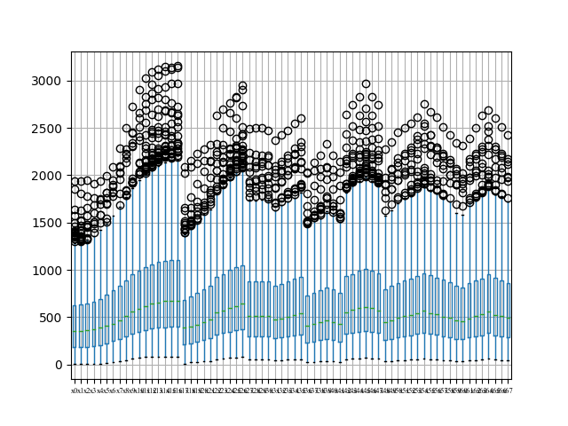
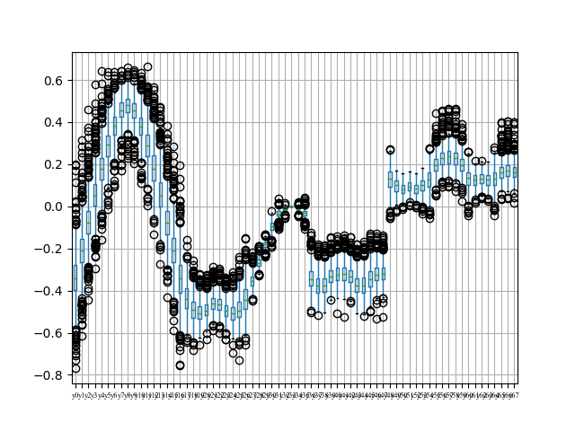
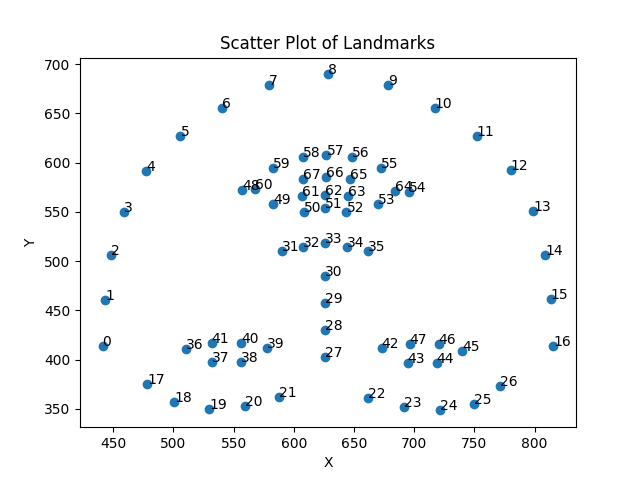

# Investigating the Best Way to Select Outliers

## Introduction

Calculate the mean, median, standard deviation, and range of the variables, and plot boxplot for each variable in the data to gain insights into the distribution.


## Result
The mean, median, standard deviation, and range of the variables
```agsl
Column x0: Mean=441.12, Median=351.00, Std=324.78, Range=1939.44
Column y0: Mean=414.17, Median=331.45, Std=302.80, Range=2158.15
Column x1: Mean=443.18, Median=354.00, Std=321.94, Range=1931.40
Column y1: Mean=460.23, Median=375.00, Std=332.98, Range=2377.14
Column x2: Mean=448.41, Median=358.65, Std=321.50, Range=1944.56
Column y2: Mean=505.70, Median=411.00, Std=365.13, Range=2563.18
Column x3: Mean=458.79, Median=373.28, Std=323.58, Range=1904.77
Column y3: Mean=549.92, Median=451.00, Std=398.40, Range=2720.06
Column x4: Mean=477.37, Median=387.00, Std=330.39, Range=1925.28
Column y4: Mean=591.51, Median=491.00, Std=430.32, Range=2824.17
Column x5: Mean=505.87, Median=406.00, Std=342.75, Range=1977.40
Column y5: Mean=626.96, Median=521.24, Std=458.78, Range=2885.66
Column x6: Mean=540.10, Median=432.29, Std=360.66, Range=2060.30
Column y6: Mean=655.41, Median=541.46, Std=482.45, Range=2888.04
Column x7: Mean=579.18, Median=467.57, Std=383.44, Range=2252.63
Column y7: Mean=678.71, Median=562.00, Std=502.14, Range=2877.31
Column x8: Mean=628.34, Median=510.74, Std=412.10, Range=2452.90
Column y8: Mean=689.63, Median=572.27, Std=507.80, Range=2845.17
Column x9: Mean=678.02, Median=559.42, Std=440.67, Range=2669.13
Column y9: Mean=678.99, Median=561.11, Std=499.83, Range=2768.80
Column x10: Mean=717.15, Median=586.10, Std=464.17, Range=2837.29
Column y10: Mean=655.67, Median=548.00, Std=478.96, Range=2717.80
Column x11: Mean=751.81, Median=617.00, Std=487.40, Range=2951.84
Column y11: Mean=627.53, Median=524.41, Std=454.25, Range=2500.68
Column x12: Mean=780.34, Median=642.98, Std=505.94, Range=3005.99
Column y12: Mean=592.42, Median=493.00, Std=425.57, Range=2337.28
Column x13: Mean=798.92, Median=656.58, Std=518.06, Range=3035.64
Column y13: Mean=551.02, Median=456.13, Std=393.58, Range=2158.42
Column x14: Mean=808.74, Median=668.56, Std=525.06, Range=3065.14
Column y14: Mean=506.64, Median=418.00, Std=360.57, Range=2029.50
Column x15: Mean=813.32, Median=670.36, Std=528.42, Range=3055.88
Column y15: Mean=460.99, Median=374.67, Std=327.86, Range=1925.23
Column x16: Mean=815.68, Median=673.38, Std=531.35, Range=3068.28
Column y16: Mean=413.45, Median=329.32, Std=297.35, Range=1872.13
Column x17: Mean=478.40, Median=386.85, Std=341.51, Range=2078.40
Column y17: Mean=375.57, Median=299.26, Std=278.33, Range=1828.41
Column x18: Mean=500.71, Median=402.58, Std=351.84, Range=2132.55
Column y18: Mean=356.77, Median=282.50, Std=263.43, Range=1682.61
Column x19: Mean=529.84, Median=424.00, Std=365.77, Range=2203.76
Column y19: Mean=350.11, Median=276.00, Std=258.17, Range=1572.00
Column x20: Mean=559.79, Median=450.58, Std=381.18, Range=2247.42
Column y20: Mean=353.15, Median=281.99, Std=259.71, Range=1492.62
Column x21: Mean=588.06, Median=475.46, Std=396.91, Range=2282.53
Column y21: Mean=361.78, Median=289.35, Std=264.54, Range=1489.99
Column x22: Mean=661.85, Median=546.86, Std=435.43, Range=2585.35
Column y22: Mean=360.75, Median=288.00, Std=262.29, Range=1477.36
Column x23: Mean=691.86, Median=569.20, Std=454.43, Range=2638.26
Column y23: Mean=351.31, Median=279.50, Std=257.09, Range=1459.54
Column x24: Mean=721.72, Median=595.55, Std=473.68, Range=2695.50
Column y24: Mean=348.32, Median=275.00, Std=255.86, Range=1492.73
Column x25: Mean=750.01, Median=620.74, Std=492.75, Range=2759.27
Column y25: Mean=355.24, Median=281.00, Std=261.96, Range=1580.71
Column x26: Mean=771.61, Median=641.00, Std=506.02, Range=2870.50
Column y26: Mean=372.91, Median=296.00, Std=276.19, Range=1686.55
Column x27: Mean=625.94, Median=514.00, Std=413.80, Range=2446.94
Column y27: Mean=402.31, Median=328.00, Std=288.92, Range=1764.71
Column x28: Mean=625.79, Median=512.21, Std=413.31, Range=2451.26
Column y28: Mean=430.47, Median=349.35, Std=310.21, Range=1837.00
Column x29: Mean=625.93, Median=516.28, Std=413.58, Range=2450.98
Column y29: Mean=457.07, Median=371.43, Std=332.14, Range=1890.70
Column x30: Mean=626.06, Median=513.00, Std=413.94, Range=2424.10
Column y30: Mean=484.52, Median=394.35, Std=355.40, Range=1941.81
Column x31: Mean=589.92, Median=477.00, Std=389.20, Range=2329.23
Column y31: Mean=510.18, Median=423.00, Std=370.10, Range=2164.28
Column x32: Mean=607.45, Median=488.00, Std=399.75, Range=2385.41
Column y32: Mean=514.59, Median=424.06, Std=374.15, Range=2139.32
Column x33: Mean=625.94, Median=508.54, Std=410.61, Range=2424.72
Column y33: Mean=518.23, Median=428.00, Std=377.94, Range=2137.97
Column x34: Mean=644.54, Median=522.00, Std=421.54, Range=2499.33
Column y34: Mean=513.85, Median=426.44, Std=373.31, Range=2131.08
Column x35: Mean=661.28, Median=541.00, Std=431.18, Range=2547.85
Column y35: Mean=509.79, Median=421.72, Std=368.70, Range=2137.63
Column x36: Mean=510.65, Median=411.53, Std=351.35, Range=2013.26
Column y36: Mean=410.50, Median=330.69, Std=296.22, Range=1893.44
Column x37: Mean=532.04, Median=429.31, Std=362.29, Range=2109.26
Column y37: Mean=397.91, Median=321.38, Std=287.29, Range=1797.76
Column x38: Mean=555.97, Median=448.67, Std=374.25, Range=2174.07
Column y38: Mean=397.59, Median=322.00, Std=286.65, Range=1774.15
Column x39: Mean=577.74, Median=470.00, Std=384.72, Range=2292.20
Column y39: Mean=411.91, Median=337.03, Std=295.76, Range=1837.31
Column x40: Mean=556.02, Median=449.00, Std=373.00, Range=2173.94
Column y40: Mean=416.94, Median=340.07, Std=299.00, Range=1858.82
Column x41: Mean=531.76, Median=429.08, Std=360.96, Range=2118.11
Column y41: Mean=417.24, Median=337.02, Std=300.37, Range=1888.48
Column x42: Mean=673.03, Median=553.21, Std=438.68, Range=2587.70
Column y42: Mean=411.70, Median=336.00, Std=294.37, Range=1807.15
Column x43: Mean=694.54, Median=574.99, Std=452.78, Range=2684.02
Column y43: Mean=396.30, Median=321.46, Std=284.28, Range=1735.34
Column x44: Mean=718.66, Median=593.51, Std=468.25, Range=2762.70
Column y44: Mean=396.47, Median=323.72, Std=284.74, Range=1719.92
Column x45: Mean=739.59, Median=611.00, Std=481.19, Range=2898.59
Column y45: Mean=408.34, Median=334.96, Std=292.81, Range=1809.49
Column x46: Mean=720.21, Median=593.93, Std=468.69, Range=2766.90
Column y46: Mean=415.74, Median=341.29, Std=297.36, Range=1805.44
Column x47: Mean=696.26, Median=573.69, Std=453.37, Range=2679.76
Column y47: Mean=416.00, Median=341.09, Std=297.40, Range=1811.12
Column x48: Mean=557.06, Median=448.06, Std=368.38, Range=2239.54
Column y48: Mean=572.30, Median=477.00, Std=412.17, Range=2459.01
Column x49: Mean=582.67, Median=466.45, Std=384.06, Range=2312.15
Column y49: Mean=557.95, Median=468.06, Std=404.59, Range=2345.43
Column x50: Mean=608.60, Median=492.00, Std=399.74, Range=2407.11
Column y50: Mean=550.16, Median=458.00, Std=400.23, Range=2311.29
Column x51: Mean=625.70, Median=509.00, Std=410.07, Range=2456.03
Column y51: Mean=553.84, Median=459.89, Std=403.54, Range=2323.60
Column x52: Mean=643.72, Median=523.00, Std=420.87, Range=2491.27
Column y52: Mean=549.98, Median=456.00, Std=400.07, Range=2294.62
Column x53: Mean=670.17, Median=545.46, Std=436.27, Range=2556.77
Column y53: Mean=557.97, Median=463.82, Std=403.80, Range=2315.90
Column x54: Mean=695.86, Median=569.00, Std=452.11, Range=2695.03
Column y54: Mean=570.64, Median=480.00, Std=409.43, Range=2391.87
Column x55: Mean=672.59, Median=544.55, Std=437.74, Range=2609.63
Column y55: Mean=594.43, Median=493.00, Std=429.74, Range=2453.90
Column x56: Mean=647.98, Median=532.56, Std=422.99, Range=2561.58
Column y56: Mean=605.46, Median=502.26, Std=439.78, Range=2512.08
Column x57: Mean=627.12, Median=507.00, Std=410.71, Range=2460.68
Column y57: Mean=607.74, Median=501.59, Std=442.11, Range=2548.98
Column x58: Mean=607.51, Median=489.81, Std=399.24, Range=2385.75
Column y58: Mean=605.84, Median=504.00, Std=440.90, Range=2543.41
Column x59: Mean=582.32, Median=468.40, Std=383.59, Range=2303.99
Column y59: Mean=595.06, Median=495.42, Std=432.13, Range=2496.48
Column x60: Mean=567.81, Median=456.95, Std=374.90, Range=2280.99
Column y60: Mean=573.26, Median=478.56, Std=413.13, Range=2439.74
Column x61: Mean=607.09, Median=486.95, Std=398.51, Range=2341.41
Column y61: Mean=566.59, Median=473.00, Std=411.44, Range=2403.01
Column x62: Mean=625.77, Median=511.29, Std=409.82, Range=2451.78
Column y62: Mean=567.08, Median=472.71, Std=412.78, Range=2400.72
Column x63: Mean=645.42, Median=528.76, Std=421.52, Range=2583.42
Column y63: Mean=565.91, Median=469.36, Std=410.85, Range=2377.84
Column x64: Mean=684.16, Median=564.00, Std=444.24, Range=2631.27
Column y64: Mean=571.51, Median=477.25, Std=410.69, Range=2380.84
Column x65: Mean=646.43, Median=527.15, Std=421.87, Range=2552.72
Column y65: Mean=583.39, Median=484.00, Std=421.50, Range=2377.84
Column x66: Mean=626.52, Median=511.07, Std=409.99, Range=2464.97
Column y66: Mean=585.67, Median=486.00, Std=423.55, Range=2400.72
Column x67: Mean=607.55, Median=492.00, Std=398.74, Range=2381.03
Column y67: Mean=583.69, Median=483.09, Std=422.30, Range=2403.01
```
### Boxplots are as follows.



### The scatter of the average of position of(x[],y[])


## Conclusion


