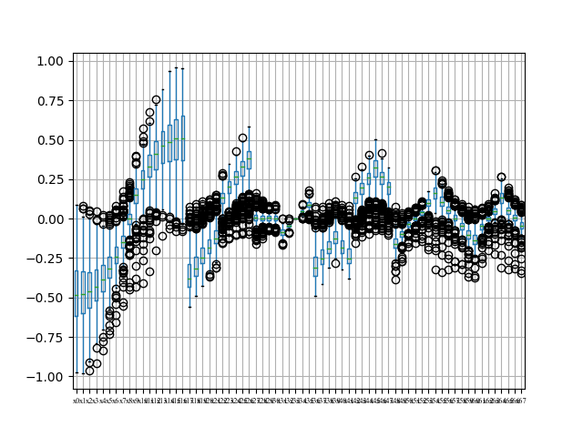

# Investigating the Best Way to Select Outliers

## Introduction

Calculate the mean, median, standard deviation, and range of the variables, and plot boxplot for each variable in the data to gain insights into the distribution.


## Result
The mean, median, standard deviation, and range of the variables
```agsl
Column x0: Mean=-0.49, Median=-0.50, Std=0.17, Range=0.81
Column y0: Mean=-0.34, Median=-0.34, Std=0.12, Range=0.97
Column x1: Mean=-0.48, Median=-0.49, Std=0.17, Range=0.78
Column y1: Mean=-0.21, Median=-0.21, Std=0.11, Range=0.93
Column x2: Mean=-0.47, Median=-0.47, Std=0.16, Range=0.76
Column y2: Mean=-0.07, Median=-0.08, Std=0.11, Range=0.90
Column x3: Mean=-0.44, Median=-0.45, Std=0.16, Range=0.72
Column y3: Mean=0.06, Median=0.05, Std=0.10, Range=0.87
Column x4: Mean=-0.39, Median=-0.41, Std=0.14, Range=0.68
Column y4: Mean=0.18, Median=0.18, Std=0.10, Range=0.80
Column x5: Mean=-0.31, Median=-0.33, Std=0.12, Range=0.61
Column y5: Mean=0.29, Median=0.29, Std=0.09, Range=0.65
Column x6: Mean=-0.22, Median=-0.23, Std=0.10, Range=0.54
Column y6: Mean=0.38, Median=0.38, Std=0.07, Range=0.55
Column x7: Mean=-0.12, Median=-0.12, Std=0.07, Range=0.54
Column y7: Mean=0.46, Median=0.46, Std=0.06, Range=0.47
Column x8: Mean=0.01, Median=0.00, Std=0.07, Range=0.57
Column y8: Mean=0.48, Median=0.48, Std=0.05, Range=0.43
Column x9: Mean=0.12, Median=0.12, Std=0.07, Range=0.58
Column y9: Mean=0.45, Median=0.45, Std=0.06, Range=0.44
Column x10: Mean=0.23, Median=0.23, Std=0.09, Range=0.63
Column y10: Mean=0.38, Median=0.38, Std=0.07, Range=0.52
Column x11: Mean=0.32, Median=0.33, Std=0.12, Range=0.69
Column y11: Mean=0.29, Median=0.29, Std=0.09, Range=0.66
Column x12: Mean=0.40, Median=0.41, Std=0.14, Range=0.71
Column y12: Mean=0.18, Median=0.18, Std=0.10, Range=0.70
Column x13: Mean=0.45, Median=0.45, Std=0.15, Range=0.74
Column y13: Mean=0.06, Median=0.05, Std=0.10, Range=0.75
Column x14: Mean=0.48, Median=0.48, Std=0.16, Range=0.73
Column y14: Mean=-0.07, Median=-0.08, Std=0.11, Range=0.81
Column x15: Mean=0.49, Median=0.49, Std=0.16, Range=0.75
Column y15: Mean=-0.21, Median=-0.21, Std=0.11, Range=0.88
Column x16: Mean=0.50, Median=0.50, Std=0.17, Range=0.84
Column y16: Mean=-0.34, Median=-0.34, Std=0.12, Range=0.95
Column x17: Mean=-0.39, Median=-0.41, Std=0.10, Range=0.72
Column y17: Mean=-0.44, Median=-0.44, Std=0.07, Range=0.49
Column x18: Mean=-0.33, Median=-0.35, Std=0.08, Range=0.67
Column y18: Mean=-0.49, Median=-0.49, Std=0.06, Range=0.43
Column x19: Mean=-0.25, Median=-0.26, Std=0.07, Range=0.58
Column y19: Mean=-0.50, Median=-0.51, Std=0.05, Range=0.34
Column x20: Mean=-0.17, Median=-0.17, Std=0.05, Range=0.47
Column y20: Mean=-0.49, Median=-0.49, Std=0.04, Range=0.31
Column x21: Mean=-0.09, Median=-0.09, Std=0.05, Range=0.38
Column y21: Mean=-0.46, Median=-0.46, Std=0.04, Range=0.30
Column x22: Mean=0.08, Median=0.09, Std=0.04, Range=0.40
Column y22: Mean=-0.46, Median=-0.47, Std=0.04, Range=0.31
Column x23: Mean=0.17, Median=0.17, Std=0.05, Range=0.43
Column y23: Mean=-0.49, Median=-0.50, Std=0.04, Range=0.30
Column x24: Mean=0.25, Median=0.26, Std=0.06, Range=0.48
Column y24: Mean=-0.51, Median=-0.51, Std=0.05, Range=0.38
Column x25: Mean=0.33, Median=0.35, Std=0.07, Range=0.61
Column y25: Mean=-0.49, Median=-0.49, Std=0.06, Range=0.49
Column x26: Mean=0.39, Median=0.41, Std=0.09, Range=0.77
Column y26: Mean=-0.44, Median=-0.44, Std=0.07, Range=0.51
Column x27: Mean=-0.00, Median=0.00, Std=0.03, Range=0.29
Column y27: Mean=-0.35, Median=-0.36, Std=0.04, Range=0.23
Column x28: Mean=-0.00, Median=0.00, Std=0.02, Range=0.20
Column y28: Mean=-0.27, Median=-0.27, Std=0.02, Range=0.14
Column x29: Mean=-0.00, Median=0.00, Std=0.02, Range=0.17
Column y29: Mean=-0.18, Median=-0.18, Std=0.02, Range=0.11
Column x30: Mean=-0.00, Median=0.00, Std=0.03, Range=0.22
Column y30: Mean=-0.09, Median=-0.09, Std=0.03, Range=0.17
Column x31: Mean=-0.10, Median=-0.10, Std=0.02, Range=0.13
Column y31: Mean=-0.03, Median=-0.03, Std=0.02, Range=0.15
Column x32: Mean=-0.05, Median=-0.05, Std=0.01, Range=0.07
Column y32: Mean=-0.02, Median=-0.01, Std=0.01, Range=0.07
Column x33: Mean=0.00, Median=0.00, Std=0.00, Range=0.00
Column y33: Mean=0.00, Median=0.00, Std=0.00, Range=0.00
Column x34: Mean=0.05, Median=0.05, Std=0.01, Range=0.08
Column y34: Mean=-0.02, Median=-0.02, Std=0.01, Range=0.07
Column x35: Mean=0.09, Median=0.09, Std=0.02, Range=0.15
Column y35: Mean=-0.03, Median=-0.03, Std=0.02, Range=0.15
Column x36: Mean=-0.30, Median=-0.31, Std=0.08, Range=0.46
Column y36: Mean=-0.34, Median=-0.34, Std=0.06, Range=0.38
Column x37: Mean=-0.24, Median=-0.25, Std=0.07, Range=0.43
Column y37: Mean=-0.37, Median=-0.38, Std=0.05, Range=0.33
Column x38: Mean=-0.18, Median=-0.19, Std=0.06, Range=0.38
Column y38: Mean=-0.37, Median=-0.37, Std=0.05, Range=0.32
Column x39: Mean=-0.13, Median=-0.13, Std=0.06, Range=0.34
Column y39: Mean=-0.33, Median=-0.33, Std=0.05, Range=0.30
Column x40: Mean=-0.18, Median=-0.19, Std=0.06, Range=0.36
Column y40: Mean=-0.32, Median=-0.32, Std=0.05, Range=0.37
Column x41: Mean=-0.25, Median=-0.26, Std=0.07, Range=0.41
Column y41: Mean=-0.32, Median=-0.32, Std=0.05, Range=0.39
Column x42: Mean=0.12, Median=0.13, Std=0.06, Range=0.45
Column y42: Mean=-0.33, Median=-0.33, Std=0.05, Range=0.31
Column x43: Mean=0.18, Median=0.19, Std=0.06, Range=0.48
Column y43: Mean=-0.37, Median=-0.38, Std=0.05, Range=0.33
Column x44: Mean=0.24, Median=0.25, Std=0.06, Range=0.57
Column y44: Mean=-0.37, Median=-0.38, Std=0.05, Range=0.35
Column x45: Mean=0.30, Median=0.31, Std=0.07, Range=0.62
Column y45: Mean=-0.34, Median=-0.35, Std=0.06, Range=0.37
Column x46: Mean=0.25, Median=0.26, Std=0.06, Range=0.56
Column y46: Mean=-0.32, Median=-0.32, Std=0.05, Range=0.40
Column x47: Mean=0.18, Median=0.19, Std=0.06, Range=0.49
Column y47: Mean=-0.32, Median=-0.32, Std=0.05, Range=0.39
Column x48: Mean=-0.19, Median=-0.19, Std=0.07, Range=0.41
Column y48: Mean=0.13, Median=0.13, Std=0.05, Range=0.33
Column x49: Mean=-0.12, Median=-0.12, Std=0.04, Range=0.30
Column y49: Mean=0.10, Median=0.10, Std=0.03, Range=0.20
Column x50: Mean=-0.05, Median=-0.05, Std=0.03, Range=0.20
Column y50: Mean=0.08, Median=0.08, Std=0.03, Range=0.17
Column x51: Mean=-0.00, Median=-0.00, Std=0.02, Range=0.17
Column y51: Mean=0.09, Median=0.09, Std=0.03, Range=0.16
Column x52: Mean=0.05, Median=0.05, Std=0.02, Range=0.19
Column y52: Mean=0.08, Median=0.08, Std=0.03, Range=0.16
Column x53: Mean=0.12, Median=0.12, Std=0.04, Range=0.31
Column y53: Mean=0.10, Median=0.10, Std=0.03, Range=0.22
Column x54: Mean=0.19, Median=0.20, Std=0.07, Range=0.42
Column y54: Mean=0.13, Median=0.13, Std=0.05, Range=0.33
Column x55: Mean=0.13, Median=0.13, Std=0.05, Range=0.37
Column y55: Mean=0.20, Median=0.20, Std=0.04, Range=0.39
Column x56: Mean=0.06, Median=0.06, Std=0.03, Range=0.34
Column y56: Mean=0.23, Median=0.23, Std=0.05, Range=0.36
Column x57: Mean=0.00, Median=-0.00, Std=0.03, Range=0.34
Column y57: Mean=0.24, Median=0.24, Std=0.05, Range=0.37
Column x58: Mean=-0.05, Median=-0.05, Std=0.04, Range=0.34
Column y58: Mean=0.23, Median=0.23, Std=0.05, Range=0.39
Column x59: Mean=-0.12, Median=-0.12, Std=0.05, Range=0.35
Column y59: Mean=0.20, Median=0.20, Std=0.04, Range=0.37
Column x60: Mean=-0.16, Median=-0.16, Std=0.07, Range=0.41
Column y60: Mean=0.13, Median=0.13, Std=0.05, Range=0.30
Column x61: Mean=-0.05, Median=-0.05, Std=0.03, Range=0.22
Column y61: Mean=0.12, Median=0.13, Std=0.03, Range=0.20
Column x62: Mean=-0.00, Median=-0.00, Std=0.02, Range=0.19
Column y62: Mean=0.13, Median=0.13, Std=0.03, Range=0.18
Column x63: Mean=0.05, Median=0.05, Std=0.03, Range=0.20
Column y63: Mean=0.12, Median=0.13, Std=0.03, Range=0.19
Column x64: Mean=0.16, Median=0.17, Std=0.06, Range=0.40
Column y64: Mean=0.13, Median=0.13, Std=0.05, Range=0.32
Column x65: Mean=0.05, Median=0.05, Std=0.03, Range=0.27
Column y65: Mean=0.17, Median=0.16, Std=0.04, Range=0.37
Column x66: Mean=-0.00, Median=-0.00, Std=0.03, Range=0.29
Column y66: Mean=0.17, Median=0.17, Std=0.04, Range=0.37
Column x67: Mean=-0.05, Median=-0.05, Std=0.03, Range=0.29
Column y67: Mean=0.17, Median=0.16, Std=0.04, Range=0.38
```
### Boxplots are as follows.





### The scatter of the average of position of(x[],y[])


## Conclusion


